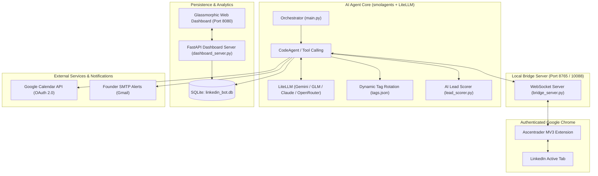

# 🚀 Autonomous LinkedIn AI Growth Engine

> An enterprise-grade, stealth AI agent built with **Hugging Face `smolagents`**, **LiteLLM**, **FastAPI**, and a **Chrome DevTools RPC Bridge** for automated high-relevance professional networking, lead qualification, conversational outreach, Google Calendar booking synchronization, and real-time founder notifications.

---

## 🌟 Overview

The **Autonomous LinkedIn AI Growth Engine** was engineered specifically for high-conviction B2B outreach and founder-led growth (configured for [Ascentrader](https://ascentrader.com)). Instead of relying on brittle scraping tools or detectable automation frameworks (such as Selenium, Puppeteer, or Playwright) that trigger platform bans, this system leverages a **Manifest V3 Chrome Extension** connected over a local **WebSocket RPC Bridge** directly to your active, authenticated Chrome browser.

By combining browser-native DevTools control with **LLM-driven autonomous decision making (`CodeAgent`)**, the engine evaluates candidate relevance, conducts personalized connection campaigns, dispatches A/B test welcome messages, tracks booking links via **Google Calendar API**, and alerts founders instantly via **SMTP** when warm prospects respond.

---

## 🏗️ Architecture Diagram



---

## ✨ Key Features

### 1. 🥷 Stealth DevTools RPC Bridge (Anti-Detection)
- **Zero Webdriver Footprint**: Connects to your real, signed-in Chrome session via Chrome Extension APIs (`chrome.debugger` / `chrome.scripting`).
- `navigator.webdriver` evaluates to `false`, completely eliminating Cloudflare, Datadome, and LinkedIn bot heuristics.
- Humanized natural delays, variable bezier scrolling, and adaptive timeouts mimic human interaction patterns.

### 2. 🧠 Autonomous CodeAgent Reasoning (`smolagents`)
- Powered by Hugging Face `smolagents` with programmatic tool calling.
- Dynamically parses search result pages, evaluates DOM nodes, handles pagination, and executes multi-step workflows.
- Built-in exponential backoff retry loop with intelligent jitter to handle rate limits and transient network interruptions.

### 3. 🎯 Precision Lead Scoring & Dynamic Tag Rotation
- Niche qualification engine (`lead_scorer.py`) scores candidate headlines and bios against customizable target keywords (e.g. funded traders, prop firm traders, quant analysts, portfolio managers).
- Only contacts profiles that meet or exceed the configurable `LEAD_SCORE_THRESHOLD` (default: `70%`).
- `tags_manager.py` continuously cycles search queries from `tags.json` to prevent audience saturation.

### 4. 💬 Multi-Stage Messaging & A/B Copy Optimization
- Automatically verifies newly accepted connections and queues personalized welcome notes.
- Built-in A/B copy split-testing tracks which messaging variant yields the highest calendar booking rate.
- Automated follow-up sequencing respects configured grace periods (`FOLLOWUP_GRACE_HOURS`).

### 5. 📅 Google Calendar API Integration
- Bi-directional OAuth 2.0 sync via `calendar_sync.py`.
- Continuously scans primary calendar for incoming strategy call bookings.
- Automatically correlates booked attendee names and emails against database candidates, updating their status to `booked`.

### 6. 🚨 Real-Time Founder Alerts & Intent Classification
- Analyzes candidate message replies using NLP and fast LLM intent classification:
  - `CALL_BOOKED`
  - `POSITIVE_INTEREST`
  - `CUSTOM_INQUIRY`
  - `NOT_INTERESTED`
- Sends immediate HTML email alerts directly to the founder via secure SMTP when high-intent prospects reply.

### 7. 📊 Glassmorphic Live Analytics Dashboard
- Built with **FastAPI** + modern dark-mode vanilla CSS and Chart.js.
- Visualizes key performance indicators (KPIs): Total Connections, Acceptance Rate, Message Rate, Meeting Conversion Rate, and daily activity logs.

---

## 📁 Project Structure

```plaintext
linkedin-bot/
├── .env.example                     # Environment variables template
├── .gitignore                        # Git exclusion rules (safeguards secrets & DB)
├── pyproject.toml                   # Project dependencies and packaging metadata
├── README.md                        # Documentation
├── tags.json                        # Configurable search tag queries & priorities
│
├── main.py                          # Master orchestration loop & CLI entrypoint
├── agent.py                         # smolagents CodeAgent setup & execution prompts
├── llms.py                          # Multi-provider LLM configurations (LiteLLM)
├── tools.py                         # Agent tool suite (Search, Connect, Message, Inspect)
├── db.py                            # SQLite schema, migrations, and CRUD operations
│
├── bridge_server.py                 # WebSocket server bridging Python and Chrome Extension
├── stealth_bridge.py                # Read-only stealth bridge for DOM observation
├── stealth_agent.py                 # Secondary inspection agent for deep DOM parsing
├── stealth_app.py                   # Gradio visual testing interface
│
├── lead_scorer.py                   # Heuristic & LLM candidate qualification engine
├── messaging_engine.py              # A/B message generation and sequence manager
├── calendar_sync.py                 # Google Calendar OAuth 2.0 sync & attendee matching
├── notifier.py                      # SMTP email alert dispatcher & reply classifier
├── tags_manager.py                  # Search tag rotation & priority weighting
│
├── dashboard_server.py              # FastAPI REST backend for live telemetry
├── dashboard/
│   └── index.html                   # Premium dark-mode glassmorphic analytics dashboard
│
├── ascentrader_extension/           # Chrome MV3 Extension (DevTools RPC Bridge)
│   ├── manifest.json
│   ├── background.js
│   ├── popup.html
│   └── icon/
│
├── stealth_extension/               # Lightweight read-only DOM reader extension
│   ├── manifest.json
│   ├── background.js
│   ├── popup.html
│   └── icon/
│
└── tests/
    ├── test_growth_engine.py        # End-to-end integration test suite
    ├── test_google_creds.py         # Google OAuth verification utility
    └── test_stealth_setup.py        # Bridge connection verification
```

---

## ⚙️ Installation & Setup

### 1. Prerequisites
- **Python 3.13+** installed
- **Google Chrome** browser
- [`uv`](https://github.com/astral-sh/uv) (recommended) or standard `python -m venv`
- A Google Cloud Project with the **Google Calendar API** enabled (OAuth 2.0 Client ID)

---

### 2. Clone & Install Dependencies

#### Using `uv` (Fastest):
```bash
# Clone the repository
git clone https://github.com/your-username/linkedin-bot.git
cd linkedin-bot

# Create virtualenv and sync dependencies
uv venv
uv pip install -e .
```

#### Using standard `pip`:
```bash
python -m venv .venv

# On Windows:
.venv\Scripts\activate
# On macOS/Linux:
source .venv/bin/activate

pip install -e .
```

---

### 3. Environment Configuration

Copy the sample environment file and configure your keys:

```bash
cp .env.example .env
```

Edit `.env` with your credentials:

```ini
# LLM Providers
GEMINI_API_KEY=your_gemini_api_key_here
OPENROUTER_API_KEY=your_openrouter_api_key_here

# Google Calendar OAuth
GOOGLE_CREDENTIALS_FILE=credentials.json
GOOGLE_TOKEN_FILE=token.json
GOOGLE_CALENDAR_ID=primary

# Lead Scoring & Campaign Config
LEAD_SCORE_THRESHOLD=70
FOLLOWUP_GRACE_HOURS=48
CALENDAR_BOOKING_URL=https://calendar.app.google/your_booking_link_here

# Founder Email Alerts (SMTP)
ALERT_EMAIL_TO=founder@example.com
ALERT_EMAIL_FROM=founder@example.com
SMTP_HOST=smtp.gmail.com
SMTP_PORT=587
SMTP_USER=founder@example.com
SMTP_PASS=your_gmail_app_password
```

---

### 4. Google Calendar API Setup

1. Go to the [Google Cloud Console](https://console.cloud.google.com/).
2. Create a new project and enable the **Google Calendar API**.
3. Configure your **OAuth Consent Screen** (User Type: External, Status: Testing).
4. Add your own email address to **Test Users**.
5. Create an **OAuth 2.0 Client ID** (Application Type: **Desktop App**).
6. Download the JSON credential file, rename it to `credentials.json`, and place it in the project root.
7. Verify setup:
   ```bash
   python test_google_creds.py
   ```
   *(On first run, a browser window will open to authenticate and generate `token.json`)*.

---

### 5. Install the Chrome Extension

1. Open Google Chrome and navigate to `chrome://extensions/`.
2. Toggle **Developer mode** in the top right corner.
3. Click **Load unpacked**.
4. Select the `ascentrader_extension` directory from this repository.
5. Pin the extension icon to your Chrome toolbar.
6. Make sure you are logged into your LinkedIn account in the same Chrome profile.

---

## 🚦 Usage & Operation

### Step 1: Start the Bridge & Dashboard
Launch the WebSocket bridge and live dashboard:
```bash
python -c "from bridge_server import bridge; bridge.start()"
```
Or start the dashboard server directly:
```bash
uvicorn dashboard_server:app --host 127.0.0.1 --port 8080 --reload
```
Navigate to `http://127.0.0.1:8080` to view the live dashboard.

---

### Step 2: Connect the Chrome Extension
1. Open LinkedIn in your Chrome browser tab (`https://www.linkedin.com`).
2. Click the **Ascentrader WebBridge** extension icon.
3. Verify that the popup indicator displays **"Connected to Bridge: OK"**.

---

### Step 3: Run the Autonomous Growth Engine

Run a complete automated session (Outreach + Messaging + Calendar Sync):

```bash
# Execute daily outreach (e.g. target: 20 verified connections)
python main.py
```

The agent will:
1. Fetch the next target tag from `tags.json`.
2. Search for relevant profiles on LinkedIn.
3. Inspect each candidate card and calculate qualification score.
4. Dispatch connection requests to high-scoring candidates with human pauses.
5. Check for accepted connections and dispatch welcome notes with calendar links.
6. Poll Google Calendar for new bookings and update pipeline stages.
7. Send real-time email summaries to the founder.

---

## 📊 Live Dashboard Preview

The built-in dashboard provides real-time telemetry into your outreach funnel:

- **Pipeline Funnel**: Visualizes conversion from *Discovered* ➔ *Requested* ➔ *Connected* ➔ *Messaged* ➔ *Booked*.
- **A/B Variant Comparison**: Tracks response and booking rates across message copy variations.
- **Candidate Database**: Search, filter, and inspect verified candidates and message history.
- **Active Tags Heatmap**: Displays priority, volume, and last-used timestamps for search keywords.

---

## 🛡️ Safety & Rate Limiting Guidelines

To protect your LinkedIn profile reputation, adhere to the following operational parameters:

- **Daily Connection Limits**: Keep connection requests to **15–25 per day** for standard accounts, or **30–50 per day** for Sales Navigator.
- **Human Delay Emulation**: Keep default pauses (`10–25 seconds`) between profile actions.
- **Operational Hours**: Schedule agent runs during standard business hours in your target audience's timezone.
- **Warm-Up Phase**: If running on a new account, start with 5 connections/day and increase gradually over 3–4 weeks.

---

## 🔒 Security & Privacy

- **Never Commit Secrets**: The `.gitignore` excludes `.env`, `token.json`, `credentials.json`, `client_secret*.json`, and `*.db`.
- **Local Storage**: All lead records, conversation states, and analytics are stored locally in `linkedin_bot.db`. No data is routed through third-party telemetry servers.

---

## 📄 License

Distributed under the MIT License. See `LICENSE` for more information.

---

<p align="center">
  Built with ❤️ for AI-first Growth & Autonomous Networking.
</p>
